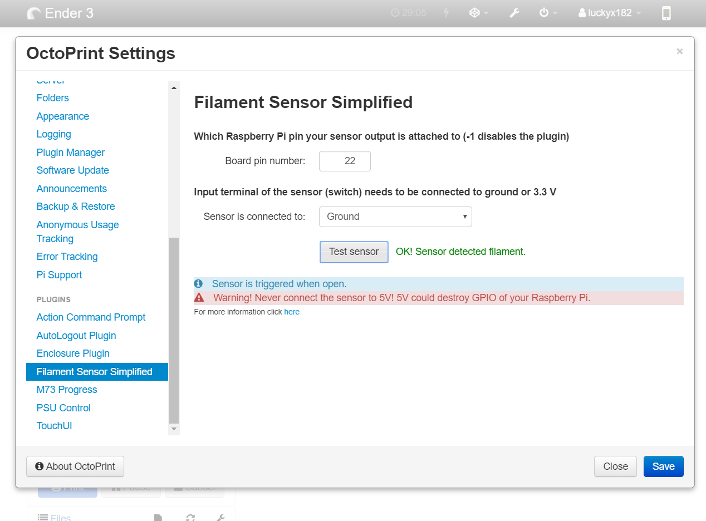
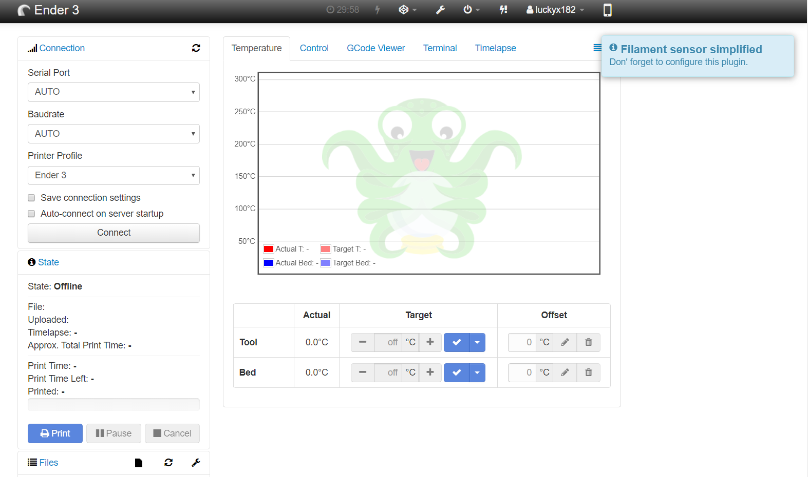
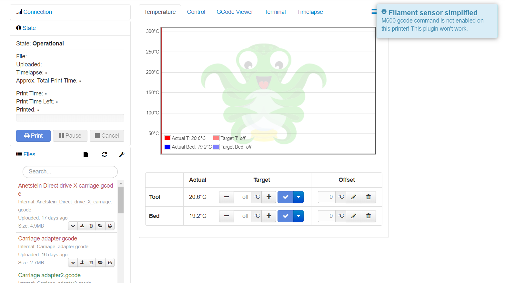
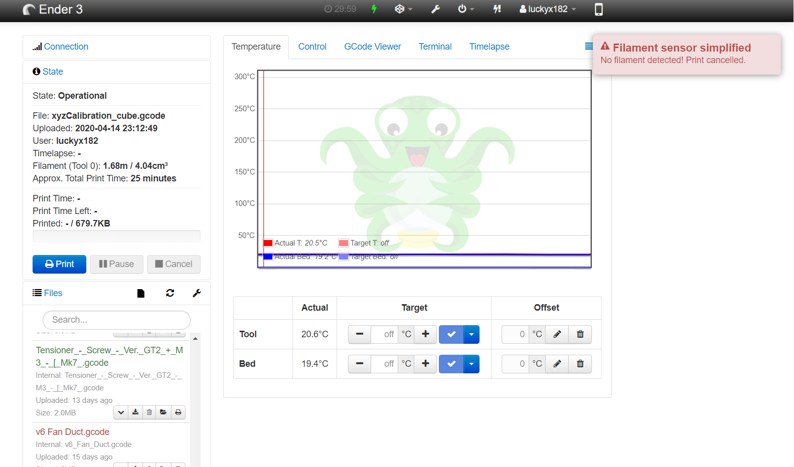
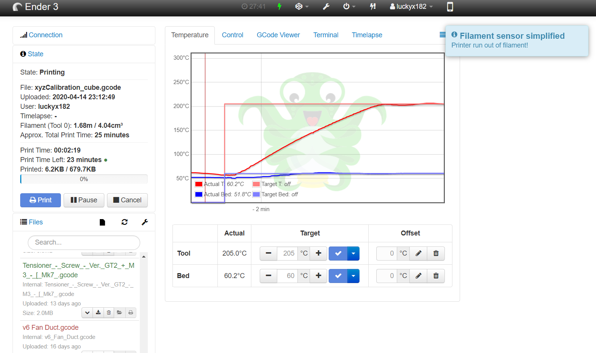
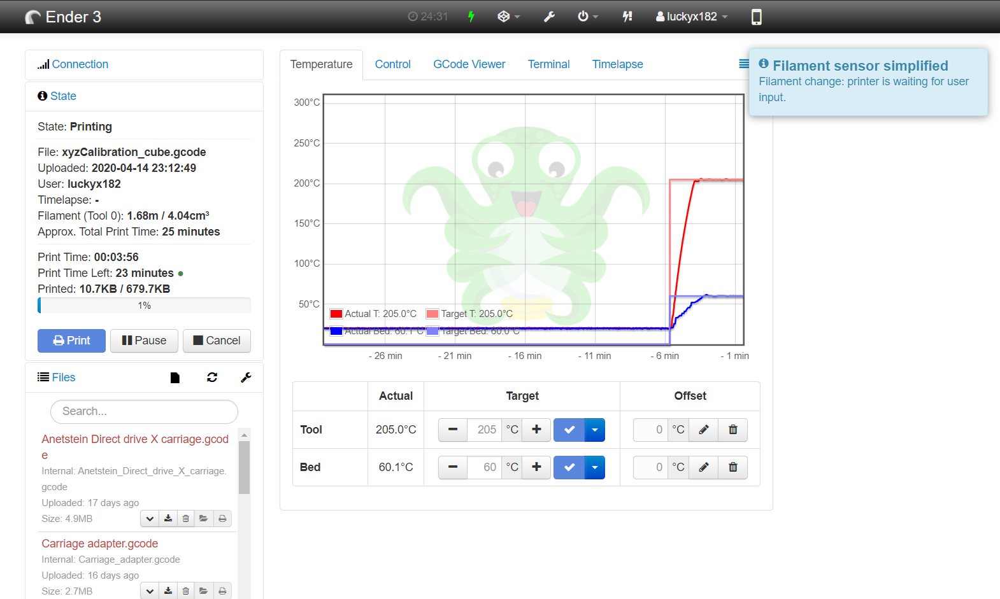

# SimplyFilament sensor

This plugin reacts to short lever microswitch output like [this](https://chinadaier.en.made-in-china.com/product/ABVJkvyMAqcT/China-1A-125VAC-on-off-Kw10-Mini-Micro-Mouse-Switch.html)
If triggered (switch open) it issues **M600 X0 Y0** command to printer.

### Features:
* pop-up notification when printer runs out of filament
* very handy pop-up when printer requires user input while changing filament
* test button so you know if your sensor really works or not
* filament check at the start of the print - if no filament present it won't start printing, again pop-up will appear
* filament check at the end of filament change - just to be sure you won't start printing with no filament
* check if printer supports M600 when printer connected - if not user will be notified through pop-up
* info pop-up when plugin hasn't been configured
* filament runouts can be repeatable which didn't work with other plugins I tried
* user-friendly and easy to configure
* pin validation so you don't accidentally save wrong pin number
* runs on OctoPrint 1.3.0 and higher

**NOTE: this plugin only works when printing through SimplyPrint or OctoPrint. When printing through SD card _(also when starting a print via. OctoPrint from your SD card)_, this plugin won't work**

## Setup

Install via the bundled [Plugin Manager](https://docs.octoprint.org/en/master/bundledplugins/pluginmanager.html)
or manually using this URL:

    https://github.com/SimplyPrint/OctoPrint-SimplyFilamentSensor/archive/master.zip

## Configuration

Configuration couldn't be simpler, all you need is to configure listening board pin (board mode) and if the second switch terminal is connected to ground or 3.3V.

Default pin is -1 (not configured) and ground (as it is safer, read below).

**WARNING! Never connect the switch input to 5V as it could fry the GPIO section of your Raspberry!**

**WARNING! When using test button on input pin used by other application it will reset internal pull up/down resistor**

#### Advice

You might experience the same problem as I experienced - the sensor was randomly triggered. Turns out that if running sensor wires along motor wires, it was enough to interfere with sensor reading.

To solve this connect a shielded wire to your sensor and ground the shielding, ideally on both ends.

If you are unsure about your sensor being triggered, check [OctoPrint logs](https://community.octoprint.org/t/where-can-i-find-octoprints-and-octopis-log-files/299)

## Screenshots

**Plugin settings:**

**No configuration pop-up:**

**Pop-up for M600 disabled:**

**No filament when starting print pop-up:**

**Filament runout pop-up:**

**Waiting for user input pop-up:**

